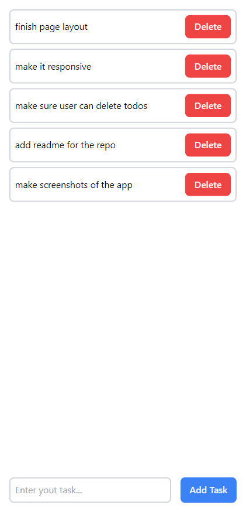
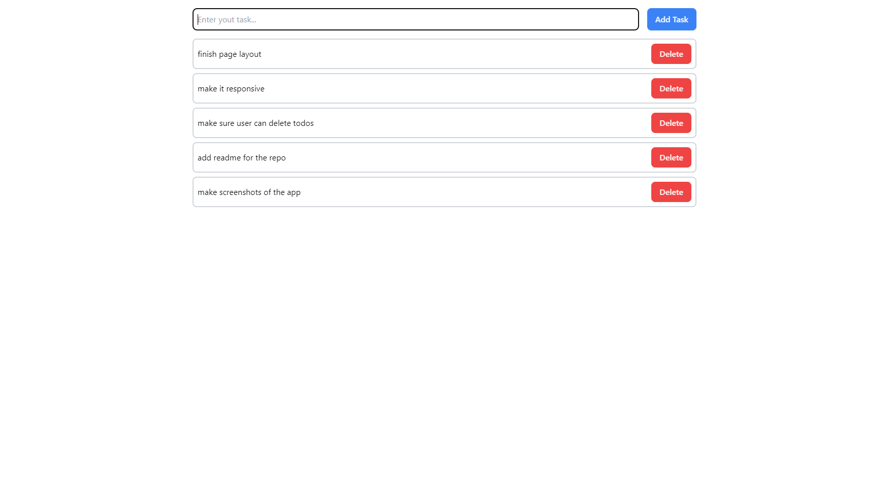

    

<h1 align="center">React To-Do app</h1>

## Table of contents

- [Table of contents](#table-of-contents)
- [About](#about)
- [Screenshots](#screenshots)
- [Built with](#built-with)
- [Links](#links)
- [License](#license)

## About

This repository contains a very basic to-do app with an ability to mark a todo as completed as well as delete it alltogether. Made with React, TailwindCSS and Vite. Fully functional, fully responsive.

## Screenshots

## Built with

## Links

- [Live Preview](https://seesmof.github.io/react-todo-app/)

## License

This project is licensed under the [MIT License](./LICENSE).

<a href="#readme-top"><strong>Back to top</strong></a>

